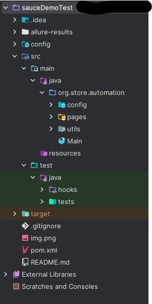

# 🧪 Swag-Labs Automation

Este proyecto automatiza el sitio [saucedemo.com](https://www.saucedemo.com) usando:

- Selenium WebDriver
- JUnit 5
- WebDriverManager
- Allure Reports
- Page Object Model (POM)
- Maven
- Java 17

---

## 📁 Estructura del Proyecto



---
## 🧱 Patron de diseño utilizado
Se implementó el patrón Page Object Model (POM), separando:

 📄pages/ → Elementos y acciones de la UI.

 🧪tests/ → Casos de prueba.

 ⚙️utils/ → Configuración común (como inicialización del WebDriver).


---
## 🚀 Requisitos Previos

- Java 17+
- Maven 3.8+
- Chrome instalado
- Allure CLI (opcional, para reportes visuales)

Puedes instalar Allure CLI desde:
```bash
# macOS (brew)
brew install allure

# Windows (choco)
choco install allure
```

---

## ⚙️ Cómo ejecutar las pruebas

1. Clona el repositorio:
```bash
git clone https://github.com/RonaldBeltran1222/Swag-Labs.git
cd Swag-Labs
```
2. Compila el proyecto:
```bash
mvn clean install
```
3. Ejecuta las pruebas:
```bash
mvn test
```

---
Tambien puedes ejecutar la prueba desde los propios archivos de prueba:
- 
- ingresas a la carpeta src/test/java/com/swaglabs/tests
- abres el archivo de prueba que deseas
- haces click derecho y seleccionas "Run 'nombre del archivo de prueba' "

---

## 📊 Cómo generar reportes Allure
Ejecuta las pruebas con Maven (como arriba)

Genera el reporte:
```bash
allure serve target/allure-results
```

Esto abrirá automáticamente el reporte en tu navegador.

---
## 👤 Credenciales válidas para login
Puedes usar las siguientes credenciales de prueba provistas por SauceDemo:

| Usuario         | Contraseña     |
| --------------- |----------------|
| `standard_user` | `secret_sauce` |
|`locked_out_user`| `secret_sauce` |
| `problem_user`  | `secret_sauce` |


